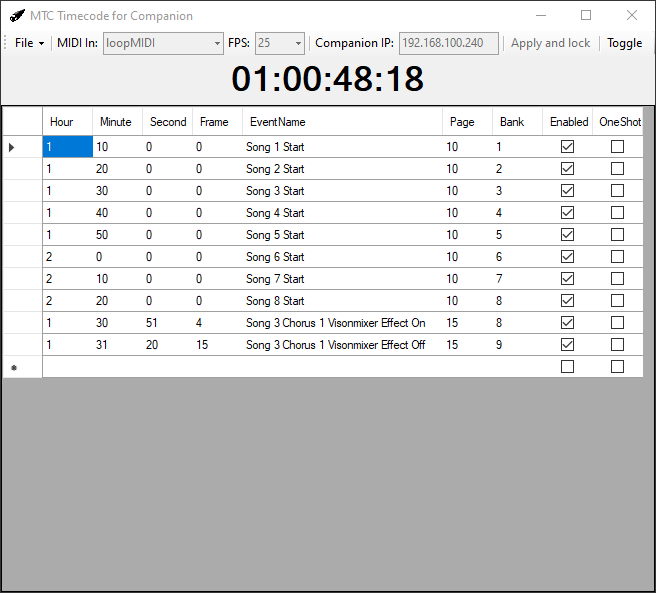

# Timecode-for-Companion
**Applications** 
This tiny application allows [Companion](https://bitfocus.io/companion/) to be triggered by MTC Midi Timecode. This can be useful for executing macros automatically during live performances  with perfect frame accuracy. Examples of use cases are: Visionmixer macro triggering, audiomixer scene recall, or anything else you can imagine!
 
The application will send UDP messages to the Companion-instance on the specified IP address. The button that will be pressed on each timecode event is specified in the cuelist. To add a cue, just start typing in the blank row!
  
**MIDI Handeling** 
The MIDI decoding is handled with [DryWet MIDI](https://github.com/melanchall/drywetmidi) with modifications made for smooth timecode chasing.
  
**Screenshots** 

